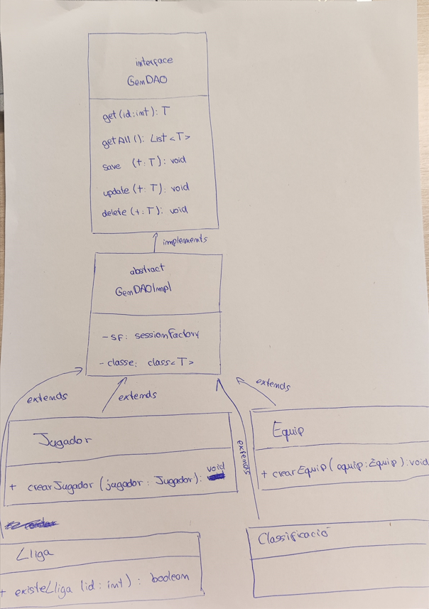

# Preguntes de reflexió i sintesi

## De quina lògica d’aplicació s’encarrega el Patró DAO?

El patró DAO (Data Access Object) s'encarrega de la lògica d'accés a dades d'una aplicació. La seva principal responsabilitat és separar la lògica de negoci de la lògica d'accés a la base de dades. Això s'aconsegueix mitjançant:

Abstracció de la base de dades: El DAO amaga els detalls de com s'accedeix a la base de dades (consultes SQL, connexions, etc.) i proporciona una interfície clara per realitzar operacions CRUD (Crear, Llegir, Actualitzar, Eliminar).

Centralització de l'accés a dades: Totes les operacions relacionades amb la base de dades es concentren en les classes DAO, cosa que facilita el manteniment i la reutilització del codi.

Independència de la base de dades: En separar la lògica d'accés a dades, és més fàcil canviar el sistema de base de dades (per exemple, de MySQL a PostgreSQL) sense afectar la resta de l'aplicació.

En resum, el patró DAO s'encarrega de gestionar la interacció amb la base de dades, proporcionant una capa d'abstracció que facilita el desenvolupament i manteniment de l'aplicació.

## Per què considereu què és útil el patró DAO i en què us ha servit?

El patró DAO és útil per diverses raons:

Separació de responsabilitats:

Ajuda a mantenir el codi net i organitzat, separant la lògica de negoci de la lògica d'accés a dades.

Això facilita la lectura, el manteniment i l'escalabilitat del codi.

Reutilització de codi:

Les operacions d'accés a dades (com consultes o insercions) es centralitzen en les classes DAO, cosa que permet reutilitzar-les en diferents parts de l'aplicació.

Facilita les proves:

En separar la lògica d'accés a dades, és més fàcil realitzar proves unitàries i simular les operacions de base de dades.

Independència de la base de dades:

Si en el futur desideixes canviar el sistema de base de dades, només necessites modificar les classes DAO, sense afectar la resta de l'aplicació.

En el meu cas, el patró DAO m'ha servit per:

Simplificar les operacions de base de dades a l'aplicació (com crear, llegir, actualitzar i eliminar lligues, equips, jugadors i classificacions).

Reduir la duplicació de codi en utilitzar mètodes genèrics a GenDAO i GenDAOImpl.

Facilitar el manteniment del codi, ja que totes les operacions de base de dades estan centralitzades a les classes DAO.

## Heu hagut de fer cap ajust al vostre codi d’aplicació (Main, Controladors, Vistes, altres classes que no siguin DAO, etc.) ? Si és així, detalleu de forma breu quins canvis heu fet i per què?

Sí, en implementar el patró DAO, he hagut de fer alguns ajustos en altres parts de la meva aplicació. Aquí et detallo els canvis més importants i per què els vaig fer:

Ajustos al Main:
Maneig d'excepcions: Com que els mètodes de GenDAO llanzen excepcions (Exception), vaig haver d'embolicar les crides a aquests mètodes en blocs try-catch al main. Això m'ha permès gestionar adequadament qualsevol error a la base de dades.

Ús de mètodes genèrics: En lloc de cridar mètodes específics com obtenirEquip o actualitzarEquip, ara faig servir els mètodes genèrics (get, save, update, delete, getAll) proporcionats per GenDAOImpl.

Ajustos a les classes DAO:
Refactorització de les classes DAO: Les classes DAO específiques (EquipDAO, JugadorDAO, LligaDAO, ClassificacioDAO) ara estenen GenDAOImpl i utilitzen els seus mètodes genèrics.

Eliminació de codi repetitiu: Vaig eliminar la duplicació de codi a les operacions CRUD, ja que ara faig servir els mètodes de GenDAOImpl.

Ajustos a les entitats (models):
Anotacions de Hibernate: Vaig assegurar-me que les classes de model (Equip, Jugador, Lliga, Classificacio) estiguin correctament anotades amb les anotacions de Hibernate (@Entity, @Id, @GeneratedValue, etc.) perquè Hibernate pugui mapejar-les correctament a la base de dades.

Ajustos a la configuració de Hibernate:
Configuració del SessionFactory: Vaig assegurar-me que el SessionFactory s'inicialitzi correctament a la classe HibernateUtil i es passi a les classes DAO.

Resum dels canvis que he fet:
Refactorització de les classes DAO:

Vaig eliminar la duplicació de codi en estendre GenDAOImpl.

Vaig utilitzar mètodes genèrics per a operacions CRUD.

Maneig d'excepcions al main:

Vaig embolicar les crides als mètodes DAO en blocs try-catch per gestionar excepcions.

Ajustos a les entitats:

Vaig verificar que les classes de model estiguin correctament anotades per a Hibernate.

Configuració de Hibernate:

Vaig assegurar-me que el SessionFactory s'inicialitzi i es passi correctament a les classes DAO.

## D’igual forma que s’ha fet a l’enunciat, completeu el diagrama de classes de l’activitat A01 de la UF2 incorporant les interfícies, la classe abstracta i els DAOs. Per acoblar això, cal que relacioneu cada classe del model amb el seu DAO (sols aquelles classes que heu treballat a l’A03, no totes!!! ):

## Per últim valoreu el paper que hi juga la classe abstracta. És en tots els casos necessària? En el cas de l’activitat A02 de la UF2, on vau emprar JDBC, penseu que seria d’utilitat?  

Paper de la classe abstracta

La classe abstracta permet definir mètodes i comportaments comuns que poden ser heretats per les subclasses. Això evita la duplicació de codi i facilita el manteniment.

Per exemple, a la meva implementació de GenDAOImpl, la classe abstracta conté mètodes genèrics com save, get, update, delete, i getAll, que són reutilitzats per totes les classes DAO.

No sempre és necessària. Si només tens una única implementació o si no hi ha una lògica comuna que es pugui reutilitzar, potser no cal una classe abstracta.

